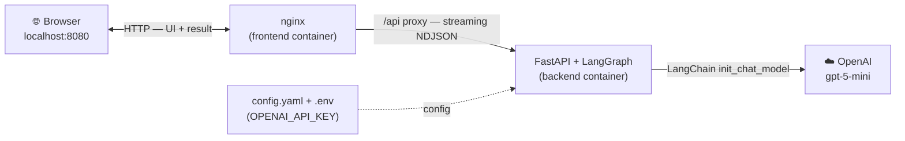
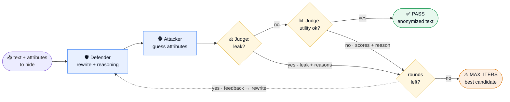

# Semantic Anonymizer

Adversarial, LLM-powered anonymizer: a **Defender** rewrites text to hide sensitive attributes, an
**Attacker** tries to infer them back, and a **Judge** rules on **both** privacy (did anything still leak?)
and utility (is the rewrite still useful?). The system loops until the Judge passes the text as *private and useful*.

Built with **LangGraph** (workflow) + **LangChain** (LLM-agnostic). Default model: **`openai:gpt-5-mini`**.

> Design docs: [docs/architecture.md](docs/architecture.md) (3 agents + the loop, LangGraph internals),
> [docs/pipeline.md](docs/pipeline.md) (the publish-dataset pipeline), [docs/topic_description.md](docs/topic_description.md).

---

## Build & run (Docker — recommended)

`docker compose up --build` builds and starts **two containers**: an **nginx** frontend (serves the UI and
proxies `/api` to the backend) and a **FastAPI + LangGraph** backend that calls the LLM.



**Prereqs:** Docker + Docker Compose.

```bash
cp .env.example .env          # then edit .env and set OPENAI_API_KEY
docker compose up --build     # builds + starts both containers
```

Open **http://localhost:8080**, paste a sentence, choose attributes to hide, hit **Anonymize** — the
Defender → Attacker → Judge flow streams round by round, then the final anonymized text appears.

Stop with `Ctrl+C`; fully remove with `docker compose down`.

---

## Build & run (local, without Docker)

**Prereqs:** [uv](https://docs.astral.sh/uv/) (`curl -LsSf https://astral.sh/uv/install.sh | sh`). uv
manages the virtualenv and the Python version (3.10+) for you.

**Backend**
```bash
cd backend
uv sync                                                # creates .venv + installs deps from uv.lock
export OPENAI_API_KEY=sk-...                           # Windows: set OPENAI_API_KEY=...  (or put it in the project-root .env)
uv run uvicorn app.main:app --reload --port 8000
```

**Frontend** — serve the static files with any web server:
```bash
cd frontend && python -m http.server 8080
```
Since the page is now on a different origin than the API, point it at the backend by adding this line
just before `<script src="app.js">` in `index.html`:
```html
<script>window.API_BASE = "http://localhost:8000";</script>
```
Then open http://localhost:8080. (CORS is enabled on the backend for dev. Under Docker this step isn't
needed — nginx proxies `/api` on the same origin.)

---

## Configuration

All settings live in **one file**: [backend/config.yaml](backend/config.yaml). The only secret is the API
key, set via `.env` (`OPENAI_API_KEY`). No hardcoded paths.

- **Swap the LLM / provider** — change the `"provider:model"` strings in `config.yaml`, e.g.
  `openai:gpt-5-mini` → `anthropic:claude-...` or `ollama:llama3.1` (LangChain handles the rest; install
  the matching `langchain-*` package and set its key). Or override all roles at once with the `MODEL` env var.
- **Tune the loop** — `max_iters` and the utility PASS thresholds (`min_task_utility`, `min_factual`,
  `min_format`). The leak verdict itself is made by the Judge LLM, so there is no confidence threshold to tune.

> Note on `temperature`: gpt-5 models accept only their default temperature, so `config.yaml` ships with
> `temperature: null` (the parameter is simply not sent). For ordinary models you can set numeric values.

---

## How it works

The whole run is one LangGraph: the **Defender** rewrites, the **Attacker** attacks, then the **Judge**
checks **privacy first** — and only if nothing leaked does it score utility. It loops until **PASS**
(private *and* useful) or gives up after `max_iters` and returns the best attempt.



> **Reading the diagram:** the Judge runs two gates in order — `utility ok?` is only checked when `leak?`
> says *no*. On a failure the Judge's findings are sent back to the Defender as **feedback** (the dotted
> edge): on a leak, *which attributes leaked and the reasons why* → rewrite harder; on low utility, *the
> scores + the reason + a "keep it safe" note* → rewrite lighter. The Defender always rewrites from the
> original text guided by this feedback, repeating until `max_iters`, then the best candidate so far is
> returned. Happy path: `input → Defender → Attacker → leak? no → utility ok? yes → PASS`.

- **Defender** — rewrites using abstraction / shifting / omission; **pure-LLM, no NER/regex layer**, so it
  also removes direct identifiers (names, emails, phones) itself; gets targeted feedback each round.
- **Attacker** — chain-of-thought inference of each target attribute, with confidence + evidence spans.
- **Judge** — runs in two sequential stages. **(1) Privacy gate** — decides whether each attribute is still
  inferable from the rewrite, reasoning over the Attacker's guesses and evidence rather than just trusting
  its self-reported confidence. **A leak short-circuits the round** — utility is *not* scored and the
  Defender is sent back to rewrite harder. **(2) Utility scoring** — reached only when nothing leaked, it
  scores `task_utility`, `factual_consistency`, `format_preserved`, etc. Tracks the best candidate across rounds.
- Stops at **PASS** (no leak + utility ok) or returns the best candidate after `max_iters` (**MAX_ITERS**).

---

## Project layout

```
backend/
  config.yaml            # single config file (models, thresholds, weights)
  pyproject.toml         # dependencies (uv)
  uv.lock                # pinned lockfile
  app/
    main.py              # FastAPI; POST /api/anonymize streams NDJSON events
    graph.py             # LangGraph wiring (compile)
    nodes.py             # defender / attacker / judge / finalize + router
    prompts.py           # the 3 agent prompts
    schemas.py           # Pydantic structured-output contracts
    scoring.py           # candidate ranking + retry-feedback builders
    llm.py               # LLM-agnostic factory (init_chat_model)
    state.py             # LangGraph shared state
frontend/                # static UI (HTML/CSS/JS) + nginx reverse proxy
docker-compose.yml
docs/                    # design docs
```

---

## API (for scripting / batch)

`POST /api/anonymize` → streams `application/x-ndjson`, one JSON event per graph step
(`start`, `node` ×N, `done` | `error`).

```bash
curl -N localhost:8080/api/anonymize -H 'Content-Type: application/json' \
  -d '{"text":"I watched the moon landing with my dad when I was six.","attributes_to_hide":["age"]}'
```

---

## Known limitations / not yet implemented

- **Single record only.** Batch over a dataset and the **cross-record** re-identification stage are
  designed in [docs/pipeline.md](docs/pipeline.md) but not in this basecode.
- **Pure-LLM by design** — no deterministic NER/regex layer; the Defender removes identifiers itself.
- **Leak verdict is LLM-based**, decided by the Judge from the Attacker's guesses and the rewrite — there is
  no `ground_truth` matching in this basecode. A `matcher` LLM hook for eval-mode scoring against known
  truths is described in [docs/architecture.md §6](docs/architecture.md).
- Cost/latency scale with `max_iters` × 3 LLM calls per round.
