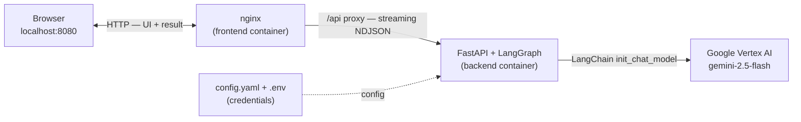

# Semantic Anonymizer

Adversarial, LLM-powered anonymizer: a **Defender** rewrites text to hide sensitive attributes, an
**Attacker** tries to infer them back, and a **Judge** rules on **both** privacy (did anything still leak?)
and utility (is the rewrite still useful?). The system loops until the Judge passes the text as *private and useful*.

Built with **LangGraph** (workflow) + **LangChain** (LLM-agnostic). Default model: **`google_vertexai:gemini-2.5-flash`**.

---

## Build & run (Docker — recommended)

`docker compose up --build` builds and starts **two containers**: an **nginx** frontend (serves the UI and
proxies `/api` to the backend) and a **FastAPI + LangGraph** backend that calls the LLM.



**Prereqs:** Docker + Docker Compose.

```bash
cp .env.example .env          # then edit .env (see steps below)
docker compose up --build     # builds + starts both containers
```

Before `up`, set **both** the credentials and the model for your chosen provider:

1. **Credentials** — put them in `.env`:
   - **OpenAI** (simplest for Docker): set `OPENAI_API_KEY=sk-...`
   - **Google Vertex AI** (the default): set `GOOGLE_CLOUD_PROJECT` and `GOOGLE_CLOUD_LOCATION`. See the Vertex note below.
2. **Model** — make sure `config.yaml` points at the provider whose key you set. Two ways:
   - Override every role at once via the `MODEL` env var in `docker-compose.yml` (an `openai:gpt-5-mini` example is already commented in there), **or**
   - Edit the model strings in [`backend/config.yaml`](backend/config.yaml) (`models.default`/`defender`/`attacker`/`judge`/`matcher`), e.g. `google_vertexai:gemini-2.5-flash` → `openai:gpt-4o`.

The key in `.env` and the provider in `config.yaml` must match — an OpenAI key with a `google_vertexai:` model (or vice-versa) fails at the first LLM call. `/api/health` and `/api/config` still return `200` without valid credentials, but `POST /api/anonymize` does not.

> **Vertex note:** Docker deployment with Vertex AI may require additional credential mounting (e.g., mounting the ADC JSON file or using a service account key). This is not yet fully configured in the Docker setup — OpenAI is the smoother Docker path.

Open **http://localhost:8080**, paste a sentence, choose attributes to hide, hit **Anonymize** — the
Defender → Attacker → Judge flow streams round by round, then the final anonymized text appears.

Stop with `Ctrl+C`; fully remove with `docker compose down`.

---

## Build & run (local, without Docker)

**Prereqs:** [uv](https://docs.astral.sh/uv/) (`curl -LsSf https://astral.sh/uv/install.sh | sh`). uv
manages the virtualenv and the Python version (3.10+) for you.

### Authentication (Google Vertex AI)

The default provider is Google Vertex AI. Authenticate locally using Application Default Credentials (ADC):

```bash
gcloud auth application-default login
gcloud auth application-default set-quota-project <your-google-cloud-project-id>
```

Set the required environment variables in `.env` (copy from `.env.example`):

```bash
GOOGLE_CLOUD_PROJECT=your-google-cloud-project-id
GOOGLE_CLOUD_LOCATION=us-central1
```

> **Security warning:** Do not commit `.env` or credential files. The `.env` file is git-ignored. The `.env.example` file is safe because it only contains placeholders.

### Alternative: OpenAI

To use OpenAI instead of Vertex AI:

1. Uncomment and set `OPENAI_API_KEY` in `.env`
2. Change the model strings in `backend/config.yaml` from `google_vertexai:gemini-2.5-flash` to `openai:gpt-4o` (or another OpenAI model)

### Alternative: Local model (Ollama)

Run fully offline against a local model — no API key, nothing leaves your machine.

1. Install Ollama (https://ollama.com) and start the server:
   ```bash
   ollama serve                 # listens on http://localhost:11434
   ```
2. Pull a model (a few GB, downloaded by Ollama — not the app):
   ```bash
   ollama pull llama3.1
   ```
3. Point the app at it — edit **only** `.env`:
   ```bash
   MODEL=ollama:llama3.1
   ```
   The app auto-uses `json_schema` structured output for Ollama (more robust than
   function-calling on local models). No `config.yaml` edit needed.

`GET /api/health` reports Ollama status (`reachable`, and whether the model is `present`).

> **Docker:** the backend container can't see `localhost` on the host. `docker-compose.yml`
> already sets `OLLAMA_BASE_URL=http://host.docker.internal:11434`. For a remote/custom host,
> set `OLLAMA_BASE_URL` in `.env`.

> **Note:** larger models need more RAM/disk. The Attacker should ideally be your strongest
> model; with the single `MODEL` knob all roles share one model.

**Backend**
```bash
cd backend
uv sync                                                # creates .venv + installs deps from uv.lock
uv run uvicorn app.main:app --reload --port 8000
```

**Frontend** — serve the static files with any web server:
```bash
cd frontend && python -m http.server 8080
```
Since the page is now on a different origin than the API, point it at the backend by adding this line
just before `<script src="app.js">` in `index.html`:
```html
<script>window.API_BASE = "http://localhost:8000";</script>
```
Then open http://localhost:8080. (CORS is enabled on the backend for dev. Under Docker this step isn't
needed — nginx proxies `/api` on the same origin.)

---

## Running tests

The project includes a pytest unit test suite (65 tests) that does not require LLM/API calls.

**Install dev dependencies and run tests:**

```bash
cd backend
uv sync --extra dev                         # installs pytest
uv run python -m pytest tests -v            # runs all tests
```

Or with pip:

```bash
pip install -e "backend[dev]"
python -m pytest backend/tests -v
```

The tests cover:
- `matcher.py` — ground_truth validation functions
- `scoring.py` — candidate scoring and feedback builders
- `ner.py` — NER/regex detection (regex-only, no spaCy model required)
- `llm.py` — `safe_structured_invoke()` with mocked chains

---

## Configuration

All settings live in **one file**: [backend/config.yaml](backend/config.yaml). Credentials are set via `.env`.

- **Swap the LLM / provider** — change the `"provider:model"` strings in `config.yaml`, e.g.
  `google_vertexai:gemini-2.5-flash` → `openai:gpt-4o` or `ollama:llama3.1` (LangChain handles the rest; install
  the matching `langchain-*` package and set its credentials). Or override all roles at once with the `MODEL` env var.
- **Tune the loop** — `max_iters` and the utility PASS thresholds (`min_task_utility`, `min_factual`,
  `min_format`). The leak verdict itself is made by the Judge LLM, so there is no confidence threshold to tune.
- **Default attributes** — when a request omits `attributes_to_hide`, the system falls back to
  `defaults.attributes_to_hide` in `config.yaml`: the eight TAB entity types (PERSON, CODE, LOC, ORG, DEM,
  DATETIME, QUANTITY, MISC) written as short descriptions, so pasted text is still anonymized sensibly with
  no manual input.

---

## How it works

The whole run is one LangGraph: the **Defender** rewrites, the **Attacker** attacks, then the **Judge**
checks **privacy first** — and only if nothing leaked does it score utility. It loops until **PASS**
(private *and* useful) or gives up after `max_iters` and returns the best attempt.


> **Reading the diagram:** the Judge runs two gates in order — `utility ok?` is only checked when `leak?`
> says *no*. On a failure the Judge's findings are sent back to the Defender as **feedback** (the dotted
> edge): on a leak, *which attributes leaked and the reasons why* → rewrite harder; on low utility, *the
> scores + the reason + a "keep it safe" note* → rewrite lighter. The Defender always rewrites from the
> original text guided by this feedback, repeating until `max_iters`, then the best candidate so far is
> returned. Happy path: `input → Defender → Attacker → leak? no → utility ok? yes → PASS`.

### Components

- **NER/regex pre-scan** — detects direct identifiers (emails, phones, URLs, SSNs, credit cards, names) via regex and optionally spaCy NER. Findings are passed as advisory hints to the Defender prompt. Falls back to regex-only if the spaCy model is not installed.
- **Defender** — rewrites using abstraction / shifting / omission; guided by NER hints and targeted feedback each round.
- **Attacker** — chain-of-thought inference of each target attribute, with confidence + evidence spans.
- **Judge** — runs in two sequential stages:
  - **(1) Privacy gate** — decides whether each attribute is still inferable from the rewrite, reasoning over the Attacker's guesses and evidence. **A leak short-circuits the round** — utility is *not* scored and the Defender is sent back to rewrite harder.
  - **(2) Utility scoring** — reached only when nothing leaked, it scores five dimensions (`task_utility`, `informational_completeness`, `factual_consistency`, `fluency`, `format_preserved`) and tracks the best candidate across rounds; PASS thresholds live in `config.yaml`.
- **Ground truth validation** — when `ground_truth` is provided in the request, attacker guesses are validated against known true values using deterministic normalized exact/contains matching. This allows evaluation mode without relying solely on the Judge LLM's verdict.
- **Safe structured output** — all LLM structured output calls use a retry wrapper (`safe_structured_invoke`) that handles `None` returns and exceptions gracefully.

---

## Project layout

```
backend/
  config.yaml            # single config file (models, thresholds, weights)
  pyproject.toml         # dependencies (uv) + dev dependencies (pytest)
  uv.lock                # pinned lockfile
  app/
    main.py              # FastAPI; POST /api/anonymize, /api/anonymize_batch
    graph.py             # LangGraph wiring (compile)
    nodes.py             # defender / attacker / judge / finalize + router
    prompts.py           # the 3 agent prompts
    schemas.py           # Pydantic structured-output contracts
    scoring.py           # candidate ranking + retry-feedback builders
    llm.py               # LLM-agnostic factory + safe_structured_invoke
    state.py             # LangGraph shared state
    ner.py               # NER/regex pre-scan for direct identifiers
    matcher.py           # deterministic ground_truth validation
    eval.py              # offline eval harness over TAB/ECHR records (judge-focused metrics)
  tests/                 # pytest unit tests (65 tests, no LLM calls)
data/
  eval/
    tab.json             # 127 TAB / ECHR gold records (attributes_to_hide + utility_to_preserve)
    type_labels.json     # TAB entity type -> detailed description fed to the agents
frontend/                # static UI (HTML/CSS/JS) + nginx reverse proxy
docker-compose.yml
CHANGES.txt              # detailed project status and change log
```

---

## API

### `POST /api/anonymize`

Streams `application/x-ndjson`, one JSON event per graph step (`start`, `node` ×N, `done` | `error`).

**Request body:**
```json
{
  "text": "I watched the moon landing with my dad when I was six.",
  "attributes_to_hide": ["age"],
  "utility_to_preserve": [],
  "channel": "text",
  "ground_truth": {"age": "6"}
}
```

- `ground_truth` (optional): A dict mapping attribute names to their true values. When provided, the Judge validates attacker guesses against these values using deterministic matching.

**Example:**
```bash
curl -N localhost:8080/api/anonymize -H 'Content-Type: application/json' \
  -d '{"text":"I watched the moon landing with my dad when I was six.","attributes_to_hide":["age"]}'
```

### `POST /api/anonymize_batch`

Processes multiple texts sequentially through the adversarial loop. Returns a single JSON response (not streaming).

**Request body:**
```json
{
  "texts": [
    "John Smith, age 42, works at Microsoft.",
    "Alice Jones, 30, is a doctor in Seattle."
  ],
  "attributes_to_hide": ["name", "age", "employer", "profession", "location"],
  "utility_to_preserve": [],
  "channel": "text",
  "ground_truth": [
    {"name": "John Smith", "age": "42", "employer": "Microsoft"},
    {"name": "Alice Jones", "age": "30", "profession": "doctor", "location": "Seattle"}
  ]
}
```

- Maximum batch size: 10 records
- `ground_truth` is a parallel array: `ground_truth[i]` applies to `texts[i]`

**Response:**
```json
{
  "batch_size": 2,
  "success_count": 2,
  "error_count": 0,
  "results": [
    {
      "index": 0,
      "status": "success",
      "original_text": "John Smith, age 42, works at Microsoft.",
      "final_text": "A professional in their forties works at a major tech company.",
      "verdict": "PASS",
      "rounds": 2,
      "leaked_attrs": [],
      "ground_truth_validation": {"name": {"matched": false}, "age": {"matched": false}}
    },
    ...
  ]
}
```

---

## Evaluation metrics

### Per-run metrics (current implementation)

The Judge LLM scores each anonymization run with these utility metrics:

- `task_utility` — how well the rewritten text preserves the intended task/purpose
- `informational_completeness` — whether key non-sensitive information is retained
- `factual_consistency` — whether the rewrite is factually consistent with the original
- `fluency` — readability and natural language quality
- `format_preserved` — whether structural formatting is maintained

Privacy verdict:
- `leaked` — boolean, whether any attribute was inferred by the Attacker
- `leaked_attrs` — list of attribute names that leaked
- `ground_truth_validation` — per-attribute match results when `ground_truth` is provided

### Dataset-level evaluation harness

[`backend/app/eval.py`](backend/app/eval.py) runs the full pipeline over a dataset of gold records and
aggregates the results. The bundled dataset is the **Text Anonymization Benchmark (TAB / ECHR)** — 127 legal
records in [data/eval/tab.json](data/eval/tab.json), each carrying gold `attributes_to_hide` (with verbatim
mention spans) and a `utility_to_preserve` list. Short TAB entity labels are expanded to detailed
descriptions via [data/eval/type_labels.json](data/eval/type_labels.json) before being fed to the agents.

```bash
# Run all records in batches of 10
python -m app.eval ../data/eval/tab.json --batch-size 10 --out results.json
```
```bash
# Resume after a crash (reads already-done records from results.json)
python -m app.eval ../data/eval/tab.json --resume --out results.json
```
```bash
# Run only the NER baseline (no LLM calls, free)
python -m app.eval ../data/eval/tab.json --ner-only --out ner_baseline.json
```
```bash
# Limit to 20 (N) records
python -m app.eval ../data/eval/tab.json --limit 20 --out results.json
```
```bash
# Run on specific records (useful for tracking improvements across prompt changes)
python -m app.eval ../data/eval/tab.json --ids tab_001-61807 tab_001-66929 --out results.json
```

Using the **verbatim presence of a gold span** as objective ground truth, it reports:

- **Judge accuracy** — leak recall over spans that are verbatim-present (the headline metric) and, critically,
  *missed leaks* (the Judge ruled "safe" while a gold identifier was still on the page).
- **System privacy** — gold leak rate of the delivered text, broken down per entity label, plus fully-clean
  and false-pass record counts.
- **Utility** — mean of the Judge's five utility scores over records that passed the privacy gate.
- **NER baseline** — same verbatim privacy metric run with plain spaCy NER masking
  (no LLM). Provides a cost-free comparison point for system_privacy metrics.
- **Attacker confidence** — mean confidence of Attacker guesses, overall and on
  attributes that actually leaked.
- **Rounds distribution** — histogram of how many loop iterations each record needed.

Results are written to two files:
- `results.json` — aggregate metrics + per-record data (verdict, rounds, leaked attrs, utility scores, attacker guesses)
- `results_texts.json` — original / LLM-anonymized / NER-anonymized text side by side for each record

Use `--texts-out` to override the default texts output path.

---

## Known limitations

- **Semantic LLM matcher not implemented.** Ground truth validation uses deterministic string matching only (exact, contains, numeric extraction). A semantic LLM-based matcher for fuzzy matches is not yet implemented.
- **Cross-record re-identification not implemented.** Batch processing handles each record independently. Analysis of re-identification risk across multiple records in a dataset is not implemented.
- **Eval ground truth is verbatim-only.** The harness ([eval.py](backend/app/eval.py)) scores leaks by exact gold-span presence, so it catches identifiers copied through unchanged but not paraphrased or purely inferential leaks (it treats those as a lower bound — see the module docstring).
- **Judge can be lenient with approximate inference.** The Judge LLM may mark "NO LEAK" even when the Attacker infers approximate values (e.g., birth year from historical context). For stricter evaluation, use `ground_truth` validation or implement numeric tolerance thresholds.
- **Ground truth validation not exposed in frontend.** The `ground_truth` field and validation results are available in the backend API but not displayed in the frontend UI.
- **Docker Vertex AI credentials.** Docker deployment with Vertex AI may require additional credential mounting that is not yet configured.
